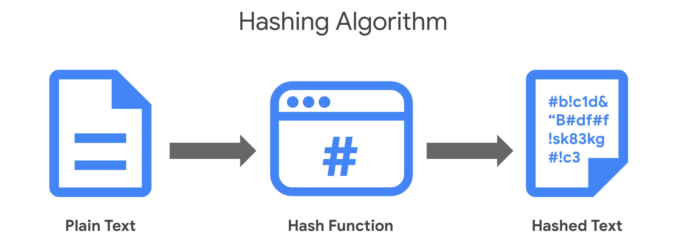
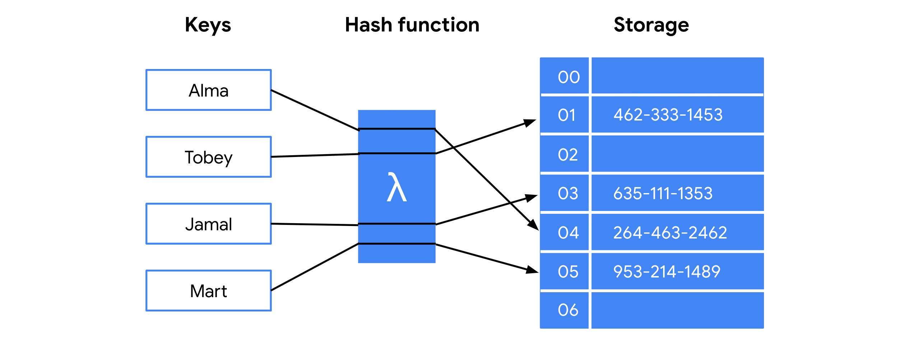
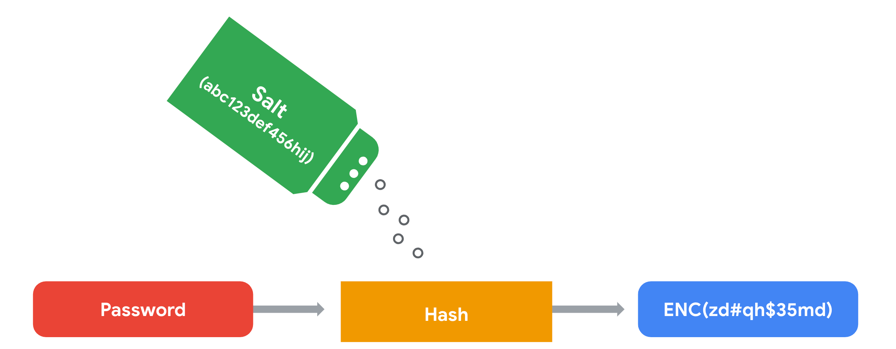

# Hash Functions

## Overview

Hash functions are critical security controls used in every company's security strategy. Hashing is widely used for:

- **Authentication:** Verifying the identity of a user or system.
- **Non-repudiation:** The concept that the authenticity of information cannot be denied.

**Hash function:** An algorithm that converts data into a unique, fixed-size value that cannot be decrypted. This value is used to verify the integrity of the original data.

## Origins of Hashing

* Hash functions have existed since the early days of computing, originally created to enable fast searching of data.
* They represent data of **any size** as a small, **fixed-size value**, called a **digest**.
* A **hash table** is a data structure used to store and reference these hash values, making data lookup faster and more secure.

### MD5 (Message Digest 5)

* One of the earliest hash functions, developed by **Professor Ronald Rivest** (MIT) in the early 1990s.
* Originally designed to verify that a file sent over a network matched its source file.
* Converts data into a **128-bit value**, represented as a **32-character string** in a hash table.
* Even a small change in the source file produces an entirely different hash value.

**Key Principle:** Generally, the longer the hash value, the more secure it is. MD5's relatively short 128-bit digest was later found to be a major vulnerability.

## Hash Collisions

**Hash collision:** An instance where different inputs produce the same hash output.

* This is an inherent flaw in **all** hash functions, since:
  * Possible **inputs** are infinite.
  * Possible **outputs** are finite (fixed-size).
* MD5 is especially vulnerable because its output is limited to 32 characters.
* Since hashes are used for authentication, a collision is similar to **identity theft** — attackers can exploit collisions to impersonate authentic data (a **collision attack**).

## Next-Generation Hashing: The SHA Family

To reduce the risk of collisions, longer hash values were needed. This led to the development of the **Secure Hashing Algorithms (SHA)**.

* Approved by the **National Institute of Standards and Technology (NIST)**.
* The number after "SHA" indicates the **size of the hash value in bits**.
* All SHA functions are considered **collision-resistant**, except for **SHA-1** (160-bit digest).
* Collision-resistant does **not** mean invulnerable to all other types of exploits.

### SHA Family Algorithms

| Algorithm | Notes |
|---|---|
| SHA-1 | 160-bit digest; not collision-resistant |
| SHA-224 | Collision-resistant |
| SHA-256 | Collision-resistant |
| SHA-384 | Collision-resistant |
| SHA-512 | Collision-resistant |

## Secure Password Storage

**Process:**

1. Passwords are stored in a database, mapped to a username.
2. The server receives an authentication request with user-supplied credentials.
3. The server looks up the username in the database.
4. The server compares the stored password with the provided password.
5. Access is granted if they match.

**Risk:** If passwords are stored in **plaintext** and an attacker gains database access, the attacker can steal and use those credentials directly.

**Solution:** Hashing adds a layer of security because hash values **cannot be reversed** — an attacker who steals hashed passwords cannot directly recover the original login credentials.

## Rainbow Tables

**Rainbow table:** A file of pre-generated hash values and their associated plaintext values — essentially a "dictionary" of common or weak passwords.

* Attackers who obtain a password database can use a rainbow table to compare stored hashes against known values and crack passwords.

## Salting

**Salt:** A random string of characters added to data before it is hashed.

* Produces a more unique hash value, even for identical inputs.
* Makes salted data resistant to rainbow table attacks.

### Example

A database might contain several hashed entries for the same password, `"password"`. If each entry is salted differently, every resulting hash value will be **completely different** — meaning an attacker's rainbow table would fail to find a match for any of them.

**Important:** The **length and uniqueness** of a salt matters — longer, more complex salts are harder to crack, just like hash values themselves.

## MD5 vs. SHA Family

| MD5 | SHA Family (SHA-224 and above) |
|---|---|
| 128-bit digest (32-character hash) | Larger digests (224–512 bits) |
| Vulnerable to collision attacks | Collision-resistant (except SHA-1) |
| Weaker against rainbow table attacks | More resistant to rainbow table attacks |
| Still used by many small/medium businesses | Recommended for stronger security needs |

## Key Takeaways

* Hashing validates the **integrity** of program files, documents, and other data.
* Hashing also helps reduce the risk and impact of **data breaches**.
* Not all hash functions offer equal protection — algorithms with shorter digests (like MD5) are more vulnerable to rainbow table attacks.
* Many small and medium-sized businesses still rely on MD5, despite its known weaknesses.
* Understanding alternative algorithms (SHA family) and **salting** enables better, more impactful security recommendations.