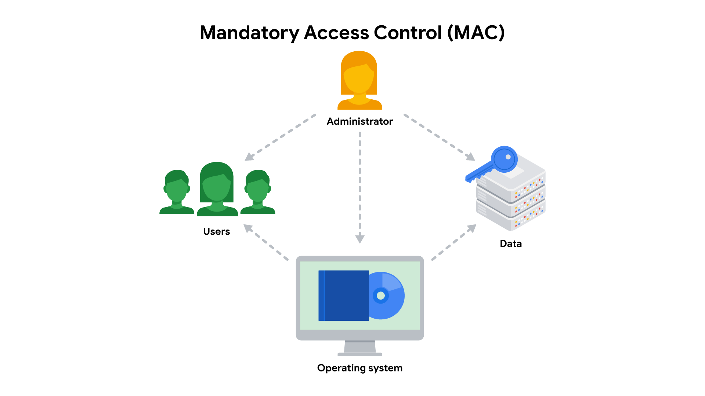
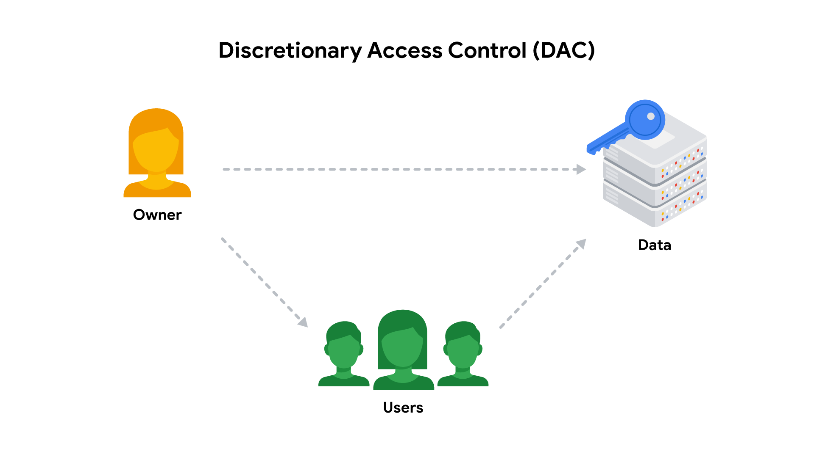
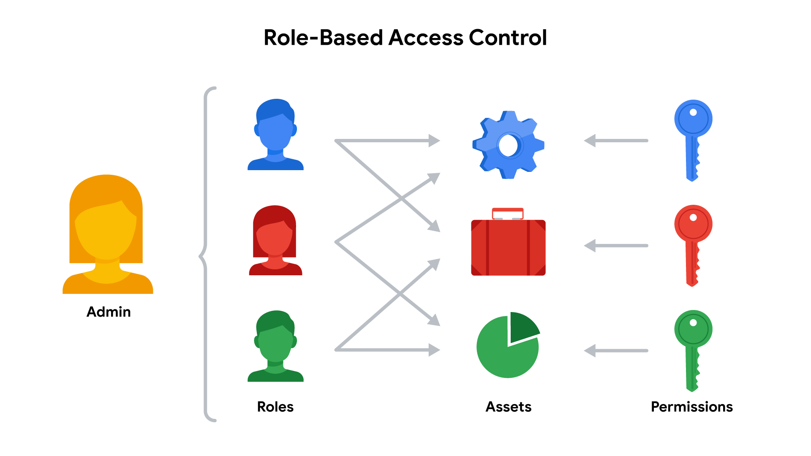

# Identity and Access Management (IAM)

Security is more than simply combining processes and technologies to protect assets. Security is about ensuring that these processes and technologies create a **secure environment** that supports a **defense strategy**.

Two fundamental security principles help limit access to organizational resources:

- **Principle of Least Privilege:** A user is granted only the minimum level of access and authorization required to complete a task or function.
- **Separation of Duties:** A principle stating that users should not be given levels of authorization that would allow them to misuse a system.

Both principles typically support each other.

### Example

Consider an organization where employees need to approve and enter IT purchases:

- According to **least privilege**, a person who needs permission to approve IT purchases should not also have permission to approve purchases from every department.
- According to **separation of duties**, the person who approves IT purchases should be different from the person who enters new purchases into the system.

In simple terms:

> **Least privilege limits the access an individual receives, while separation of duties divides responsibilities among multiple people to prevent any one person from having too much control.**

**Note:** Separation of duties is sometimes referred to as **segregation of duties**.

# Authentication, Authorization, and Accounting (AAA)

The **Authentication, Authorization, and Accounting (AAA)** framework is one model businesses can use to implement security principles and manage user access.

AAA focuses on:

- **Authentication:** Verifying who a user is.
- **Authorization:** Determining what a user is allowed to access.
- **Accounting:** Tracking a user's activities within a system.

Another major framework used to manage user access is **Identity and Access Management (IAM)**.

# Identity and Access Management (IAM)

**Identity and Access Management (IAM):** A collection of processes and technologies that helps organizations manage **digital identities** within their environment.

As organizations become more reliant on technology, regulatory agencies have placed increasing pressure on them to demonstrate that they are taking appropriate measures to prevent threats.

Both **AAA** and **IAM** systems are designed to:

- Authenticate users
- Determine their access privileges
- Track their activities within a system

Neither AAA nor IAM is a single, clearly defined system. Instead, each consists of a **collection of security controls**.

These controls help ensure that:

1. The **right user** is granted access.
2. To the **right resources**.
3. At the **right time**.
4. For the **right reasons**.

These four factors are determined by an organization's **policies and processes**.

**Note:** A user can be:

- A **person**
- A **device**
- **Software**

# Authenticating Users

To ensure that the right user is attempting to access a resource, the organization needs some form of proof that the user is who they claim to be.

There are three main authentication factors:

- **Knowledge:** Something the user knows.
- **Ownership:** Something the user possesses.
- **Characteristic:** Something the user is.

### Authentication Factors

| Factor | Meaning | Examples |
|---|---|---|
| **Knowledge** | Something the user knows | Password, security question |
| **Ownership** | Something the user possesses | One-time passcode (OTP), security token |
| **Characteristic** | Something the user is | Fingerprint, facial scan |

### Pro Tip

A simple way to remember the authentication model is:

> **Something you know + something you have + something you are**

Authentication is mainly verified using **login credentials**.

Organizations can also use:

- **Single Sign-On (SSO):** A technology that combines several different logins into one.
- **Multi-Factor Authentication (MFA):** A security measure that requires a user to verify their identity in two or more ways to access a system or network.

# User Provisioning

**User Provisioning:** The process of creating and maintaining a user's **digital identity**.

Back-end systems need to verify whether the information provided by a user is accurate. To accomplish this, users must be properly provisioned.

### Example

A college may create a new user account when a new instructor is hired.

The account can be configured to:

- Provide access to **instructor-only resources**.
- Remain available while the instructor is teaching.
- Give the instructor the appropriate access privileges.

Security analysts are routinely involved in **provisioning users and their access privileges**.

## User Deprovisioning

**User Deprovisioning:** The process of removing a user's access rights when they should no longer have them.

Deprovisioning is an important IAM practice because it prevents former employees or users from retaining access to organizational resources after their access is no longer required.

# Granting Authorization

After the right user has been authenticated, the network must ensure that the **right resources** are made available.

Three common access control frameworks are used to handle authorization:

1. **Mandatory Access Control (MAC)**
2. **Discretionary Access Control (DAC)**
3. **Role-Based Access Control (RBAC)**

# Mandatory Access Control (MAC)

**Mandatory Access Control (MAC):** An access control model in which authorization is based on a strict **need-to-know** basis and access is controlled by a central authority or system administrator.

MAC is the **strictest** of the three access control frameworks.

Characteristics of MAC include:

- Access is based on a strict **need-to-know** requirement.
- Access to information must be granted manually by a **central authority or system administrator**.
- Users generally cannot decide their own access permissions.
- It is commonly used in environments requiring high levels of security.

### Examples

MAC is commonly applied in:

- **Law enforcement**
- **Military organizations**
- **Government agencies**

For example, users may need to request access through a **chain of command** before they can access sensitive information.

**MAC is also known as non-discretionary access control** because access is not granted at the discretion of the data owner.

# Discretionary Access Control (DAC)

**Discretionary Access Control (DAC):** An access control model in which the **data owner** determines the appropriate levels of access to their resources.

In DAC, the owner of the data has discretion over who can access it and what permissions they receive.

### Example

A Google Drive folder owner can share the folder with another person and choose a permission level such as:

- **Editor**
- **Viewer**
- **Commenter**

The data owner decides which users receive these permissions.

# Role-Based Access Control (RBAC)

**Role-Based Access Control (RBAC):** An access control model in which authorization is determined by a user's **role within an organization**.

Instead of assigning permissions individually to every user, permissions are associated with specific organizational roles.

### Example

A user working in the **marketing department** may have:

- Access to **user analytics**
- No access to **network administration**

The user's permissions are determined by their organizational role.

# Access Control Technologies

Users often experience authentication and authorization as a **single, seamless process**. This is largely because different access control technologies are configured to work together.

These technologies provide:

- **Speed**
- **Automation**
- Ability for administrators to **monitor access rights**
- Ability to **modify access rights**
- Reduced errors
- Reduced security risks

## Components of IAM and AAA Systems

A typical IAM or AAA system consists of several components:

| Component | Purpose |
|---|---|
| **User Directory** | Stores information about users and their identities |
| **Directory Management Tools** | Manage data stored in the user directory |
| **Authorization System** | Determines what users are allowed to access |
| **Auditing System** | Tracks and records user activities |

### Custom Access Control Technologies

An organization's IT department may develop and maintain its own customized access control technologies.

Custom systems can be designed to meet an organization's specific **security requirements**.

However, building an **in-house solution** can require significant:

- Time
- Financial resources
- Technical resources
- Maintenance effort

### Third-Party Solutions

Instead of building their own systems, many organizations choose to **license third-party solutions**.

These solutions often provide a suite of tools that allow organizations to quickly secure their information systems.

However, simply combining multiple security tools does not automatically create a secure environment.

> **Security depends on properly configuring technologies so that they work together to provide a secure environment.**

# AAA vs IAM

AAA and IAM are both frameworks used to manage user access and support organizational security objectives.

| AAA | IAM |
|---|---|
| Authentication, Authorization, and Accounting | Identity and Access Management |
| Authenticates users | Manages digital identities |
| Determines access privileges | Determines and manages access privileges |
| Tracks user activities | Tracks and manages identity and access activities |
| Can be implemented using a collection of security controls | Consists of a collection of processes and technologies |

Both frameworks help organizations ensure:

> **The right user has access to the right resources at the right time for the right reasons.**

# Least Privilege vs Separation of Duties

| Principle | Purpose | Example |
|---|---|---|
| **Least Privilege** | Limits the amount of access given to an individual | An employee responsible for IT purchases can only approve IT purchases |
| **Separation of Duties** | Divides responsibilities among multiple people | One employee approves purchases while another enters them |

### Key Difference

- **Least Privilege → Limits access**
- **Separation of Duties → Divides responsibilities**

Both principles reduce the possibility of **misuse of systems** and excessive control by a single individual.

# Key Takeaways

- Security requires more than simply combining technologies and processes. They must work together to create a **secure environment**.
- **Least privilege** gives users only the minimum access required to perform their tasks.
- **Separation of duties** divides responsibilities among multiple people to prevent excessive control by one person.
- **AAA** and **IAM** are common frameworks for managing user access.
- **IAM** is a collection of processes and technologies used to manage digital identities.
- Both AAA and IAM help ensure that the **right user** gets access to the **right resources** at the **right time** and for the **right reasons**.
- Authentication can be based on:
  - **Knowledge**
  - **Ownership**
  - **Characteristic**
- **User provisioning** creates and maintains a user's digital identity.
- **User deprovisioning** removes access when a user should no longer have it.
- Three common authorization frameworks are:
  1. **MAC**
  2. **DAC**
  3. **RBAC**
- **MAC** is the strictest and is controlled by a central authority.
- **DAC** allows the data owner to determine access.
- **RBAC** determines access based on a user's organizational role.
- Organizations can build custom access control systems or use **third-party solutions**.
- Security technologies must be **properly configured** to create a secure environment.

# Resources for More Information

The identity and access management industry is growing rapidly. As with other areas of cybersecurity, security professionals should stay informed about developments in the field.

- **IDPro:** A professional organization dedicated to sharing essential identity and access management industry knowledge.
  - https://idpro.org/

## Key Takeaways

- **Least Privilege:** Give users only the access they need.
- **Separation of Duties:** Divide responsibilities to prevent one person from having too much control.
- **IAM:** Manages digital identities and user access.
- **AAA:** Authentication, Authorization, and Accounting.
- **Authentication:** Verifies who the user is.
- **Authorization:** Determines what the user can access.
- **Provisioning:** Creates and maintains user access.
- **Deprovisioning:** Removes unnecessary user access.
- **MAC:** Access controlled by a central authority.
- **DAC:** Access controlled by the data owner.
- **RBAC:** Access based on the user's role.
- **SSO:** One login for multiple resources.
- **MFA:** Uses two or more authentication factors.
- Both **IAM and AAA** help ensure the **right user** gets the **right resources** at the **right time** for the **right reasons**.