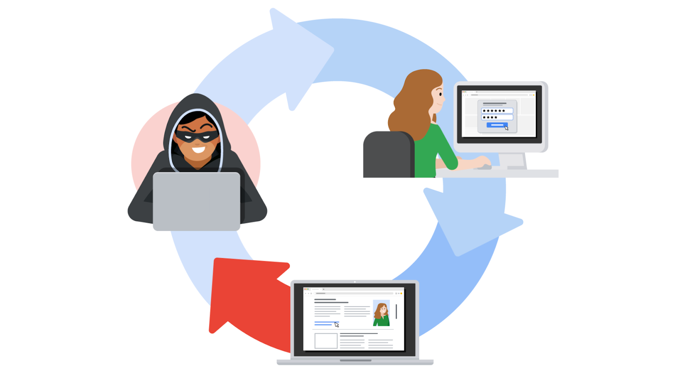

# OWASP and the OWASP Top 10

## Overview

To prepare for future risks, security professionals need to stay informed. Previously, the **CVE list** was covered — an openly accessible dictionary of known vulnerabilities and exposures used by the global security community.

This reading covers another key resource: the **Open Worldwide Application Security Project (OWASP)** (formerly the Open Web Application Security Project). It explains OWASP's role in the global security community and how companies use it to focus their security efforts.

## What Is OWASP?

**OWASP:** A nonprofit foundation that works to improve the security of software.

* An open platform used by security professionals worldwide to share information, tools, and events focused on securing the web.

## The OWASP Top 10

**OWASP Top 10:** A list published by OWASP since 2003 to spread awareness of the web's most targeted vulnerabilities.

* Mainly applies to **new or custom-made software**.
* Referenced by many of the world's largest organizations during application development to help avoid common security mistakes.
* Updated every few years as technologies evolve.
* Rankings are based on:
  * How often each vulnerability is discovered.
  * The level of risk each vulnerability presents.

**Note:** Auditors also use the OWASP Top 10 as a reference point when checking for regulatory compliance.

### OWASP Top 10 vs. CVE List

| OWASP Top 10 | CVE List |
|---|---|
| Focuses on the most common **categories** of vulnerabilities | Catalogs specific, individual vulnerabilities and exposures |
| Influences how businesses **design new software** | Helps identify improvements to **existing** programs |
| Used mainly during application development | Used to track and reference known flaws across products |

## Common Vulnerabilities in the OWASP Top 10

### Broken Access Control

**Access controls** limit what users can do within a web application.

* Example: A blog might let visitors post comments but restrict them from deleting an article.
* Failures in access control mechanisms can lead to:
  * Unauthorized information disclosure, modification, or destruction.
  * Unauthorized access to other business applications.

### Cryptographic Failures

* Information is one of the most important assets a business must protect.
* Privacy laws such as the **General Data Protection Regulation (GDPR)** require sensitive data to be protected through effective encryption.
* Vulnerabilities occur when businesses fail to properly encrypt data such as **personally identifiable information (PII)**.
* Example: Using a weak hashing algorithm like **MD5** increases the risk of a data breach.

### Injection

**Injection** occurs when malicious code is inserted into a vulnerable application, causing it to perform unintended actions while appearing to function normally.

* Injection attacks can give threat actors a backdoor into an organization's information system.
* A common target is a website's **login form** — if vulnerable, attackers can insert malicious code to modify or steal user credentials.

### Insecure Design

* Applications should be designed to be resilient to attack.
* **Insecure design** refers to missing or poorly implemented security controls that should have been built in during development.
* Poorly designed applications are more vulnerable to threats like injection attacks and malware infections.

### Security Misconfiguration

* Occurs when security settings are not properly set or maintained.
* Common cause: using **default settings** when deploying equipment (e.g., a network server).
* Businesses using multiple interconnected systems are especially prone to configuration mistakes if systems aren't properly set up or audited.

### Vulnerable and Outdated Components

* Relates mainly to **application development**.
* Developers often use **open-source libraries** (maintained by volunteer communities) instead of coding everything from scratch.
* Applications using outdated or unmaintained components are at greater risk of exploitation.

### Identification and Authentication Failures

* Occurs when an application fails to correctly recognize **who** should have access and **what** they are authorized to do.
* Example: A home Wi-Fi router uses a login form to keep out unwanted guests. If this defense fails, an attacker can invade the homeowner's privacy.

### Software and Data Integrity Failures

* Occur when updates or patches are **inadequately reviewed** before being implemented.
* Attackers can exploit these weaknesses to deliver malicious software.
* This can lead to a **supply chain attack** — where a single compromised system infects third parties downstream.

#### Example: SolarWinds Attack (2020)

A well-known supply chain attack in which hackers injected malicious code into software updates that SolarWinds unknowingly distributed to its customers.

### Security Logging and Monitoring Failures

* It's critical to be able to **log and trace back** security events (e.g., login attempts) to find and fix problems.
* Sufficient monitoring and incident response capability is equally important.

### Server-Side Request Forgery (SSRF)

* Companies store public and private information on **web servers**.
* Normally, a request (e.g., clicking a link or button) is sent to a server, which validates the user, fetches the appropriate data, and returns it.
* **SSRF:** An attack where a threat actor manipulates a server's normal operations to read or update other resources on that server.

* Possible when an application running on the server is vulnerable — malicious code can use that app to reach the host server and fetch unauthorized data.

## OWASP Top 10 Categories: Quick Reference

| Vulnerability Category | Core Issue |
|---|---|
| Broken access control | Users can perform actions or access data they shouldn't |
| Cryptographic failures | Sensitive data isn't properly encrypted |
| Injection | Malicious code inserted into an application |
| Insecure design | Missing or poor security controls built into the app |
| Security misconfiguration | Security settings not properly set or maintained |
| Vulnerable and outdated components | Use of unmaintained/insecure third-party libraries |
| Identification and authentication failures | App fails to correctly verify identity/authorization |
| Software and data integrity failures | Inadequately reviewed updates/patches; supply chain risk |
| Security logging and monitoring failures | Insufficient event logging, tracing, or monitoring |
| Server-side request forgery (SSRF) | Attacker manipulates a server into fetching unauthorized data |

## Key Takeaways

* Staying informed about current cybersecurity trends helps defend against attacks and prepare for future risks.
* The **[OWASP Top 10](https://owasp.org/www-project-top-ten/)** is a valuable resource for learning about the most common and impactful web application vulnerabilities.
* Unlike the CVE list (which tracks specific known flaws), the OWASP Top 10 primarily shapes how **new software is designed** to avoid common security mistakes from the start.