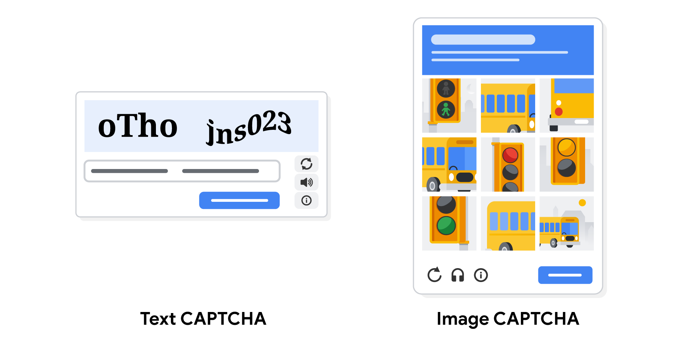

# Brute Force Attacks 

## The Problem with Credentials
- Usernames/passwords act like door locks restricting access to networks, services, data.
- Weakness: vulnerable to being stolen or guessed.

## Types of Brute Force Attacks
- **Simple brute force** – guess login credentials by trying any combination until one works
- **Dictionary attack** – use a list of commonly used credentials (like matching words in a dictionary)
- **Reverse brute force attack** – start with one credential, try it across many systems until a match
- **Credential stuffing** – use stolen credentials from past breaches to access accounts elsewhere
  - **Pass the hash** – specialized version; reuses stolen, unsalted hashed credentials to trick auth systems into creating a new session
- Note: encrypted info can also be brute forced via **exhaustive key search**

## Brute Forcing Tools
- **Aircrack-ng** – e.g., testing Wi-Fi networks for vulnerabilities
- **Hashcat**
- **John the Ripper**
- **Ophcrack**
- **THC Hydra**
- Used by attackers, but also by security professionals to test their own systems.

## Prevention Measures

### Hashing & Salting
- **Hashing**: converts info into a unique value to check integrity.
- **Salting**: adds random characters to data (e.g., passwords) before hashing → increases complexity, harder to brute force/dictionary attack.

### Multi-Factor Authentication (MFA)
- Requires 2+ forms of identity verification.
- Layered protection — limits brute force success even if one credential is compromised.

### CAPTCHA
- **C**ompletely **A**utomated **P**ublic **T**uring test to tell **C**omputers and **H**umans **A**part.
- Challenge-response system proving the user is human, not automated software.
- Two types: distorted text entry, or image-matching to a word.

### Password Policy
- Managerial control standardizing good password practices.
- Examples: min. 8 characters with letter/number/symbol, lockout after failed attempts, periodic password changes.
- Goal: increase possible combinations → lengthen time needed to crack.
- Reference: **[NIST Special Publication 800-63B-4](https://nvlpubs.nist.gov/nistpubs/SpecialPublications/NIST.SP.800-63b-4.pdf)** for password policy guidance.

## Key Takeaways
- Brute force attacks are simple but reliable for gaining unauthorized access.
- Stronger passwords = more resilient to cracking.
- Security professionals may use the same tools attackers use, to test their own systems.