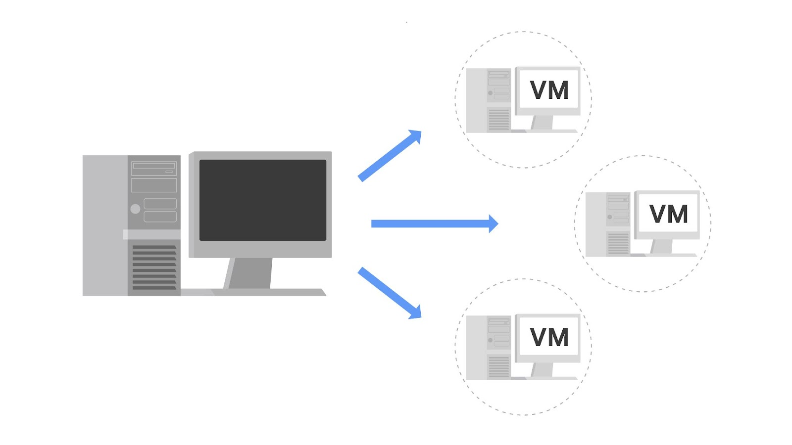

# Virtual Machines and Virtualization

## Overview

A **Virtual Machine (VM)** is a virtual version of a physical computer. Virtual machines are an example of **virtualization**, a technology commonly used in the security industry.

Virtualization allows software to create virtual representations of physical hardware. Virtual machines operate like physical computers, but their hardware is software-defined rather than physically dedicated.

## What Is Virtualization?

**Virtualization:** The process of using software to create virtual representations of physical machines or other resources.

The term **virtual** refers to systems that do not physically exist but operate similarly to physical systems because software simulates the required hardware.

A virtual machine has virtual versions of hardware components such as:

- CPU
- Storage
- RAM
- Other hardware resources

Virtual systems are essentially software-defined systems.



## How Virtual Machines Work

Multiple virtual machines can run on the physical hardware of a single computer.

The physical computer is called the **host**, while the virtual machines running on it are called **guests**.

The host's physical resources are divided and shared among the virtual machines.

### Example

Suppose a physical computer has **16 GB of RAM**.

It could allocate:

- 4 GB to the physical host
- 4 GB to Virtual Machine 1
- 4 GB to Virtual Machine 2
- 4 GB to Virtual Machine 3

Each virtual machine can have its own operating system and function similarly to a physical computer.

```text
Physical Host
├── Host Operating System / Resources
├── VM 1 → 4 GB RAM → Operating System
├── VM 2 → 4 GB RAM → Operating System
└── VM 3 → 4 GB RAM → Operating System
```

The actual allocation of resources depends on the host's available hardware and the configuration of the virtual machines.

## Benefits of Virtual Machines

Security professionals commonly use virtualization because it can improve:

- Security
- Efficiency
- Convenience

## Security

Virtualization can provide an **isolated environment**, often referred to as a **sandbox**, on the physical host.

Virtual machines are isolated from:

- The host system
- Other guest virtual machines

This isolation provides an additional layer of security.

### Malware Analysis

Virtual machines can be useful for investigating potentially infected systems or examining malware.

For example, a security professional can intentionally place malware inside a virtual machine and analyze its behavior in an isolated environment.

If the virtual machine becomes infected, the isolation can help reduce the risk to the host and other systems.

> **Note:** Virtualization does not provide complete security. Malicious software can potentially escape the virtualized environment and access the host machine. Virtualized systems should therefore not be treated as completely trusted or isolated.

## Efficiency

Virtual machines can make security tasks more efficient and convenient.

Security professionals can:

- Run multiple virtual machines simultaneously
- Switch between virtual machines easily
- Test applications
- Explore different environments
- Perform security-related experiments

Multiple virtual machines can share the hardware resources of a single physical machine, reducing the need for separate physical computers.

### Resource Sharing Analogy

Virtualization can be compared to a city bus.

A single bus can transport many people at the same time, using fewer resources than requiring every person to use a separate car.

Similarly, a single physical computer can host multiple virtual machines, allowing different environments to share the same physical hardware.

## Managing Virtual Machines

Virtual machines can be managed using a **hypervisor**.

**Hypervisor:** Software that manages virtual machines, connects virtual and physical hardware, and allocates physical resources among virtual machines.

Hypervisors help manage:

- Virtual machines
- Physical hardware resources
- Virtual hardware
- Resource allocation

### Kernel-based Virtual Machine (KVM)

**Kernel-based Virtual Machine (KVM):** An open-source hypervisor supported by most major Linux distributions.

KVM is built into the Linux kernel, allowing Linux systems to create and manage virtual machines without requiring a separate hypervisor application.

## Other Forms of Virtualization

Virtual machines are only one type of virtualization.

Other forms include:

### Server Virtualization

Multiple virtual servers can be created from a single physical server.

This allows organizations to use physical hardware more efficiently.

### Network Virtualization

Virtual networks can be created to improve the utilization of physical network hardware.

Virtualization can therefore be applied to different types of computing and networking resources, not only complete virtual machines.

## Key Takeaways

- A **Virtual Machine (VM)** is a virtual version of a physical computer.
- **Virtualization** uses software to create virtual representations of physical hardware or systems.
- Multiple VMs can share the resources of a single physical computer.
- The physical computer is the **host**, while virtual machines are **guests**.
- Virtual machines provide isolation that can be useful for malware analysis and security testing.
- Virtualization is not completely secure because malicious software can potentially escape the virtual environment.
- VMs improve efficiency by allowing multiple environments to run on the same physical hardware.
- A **hypervisor** manages virtual machines and allocates physical resources to them.
- **KVM** is an open-source hypervisor built into the Linux kernel.
- Virtualization can also be used for servers and networks.