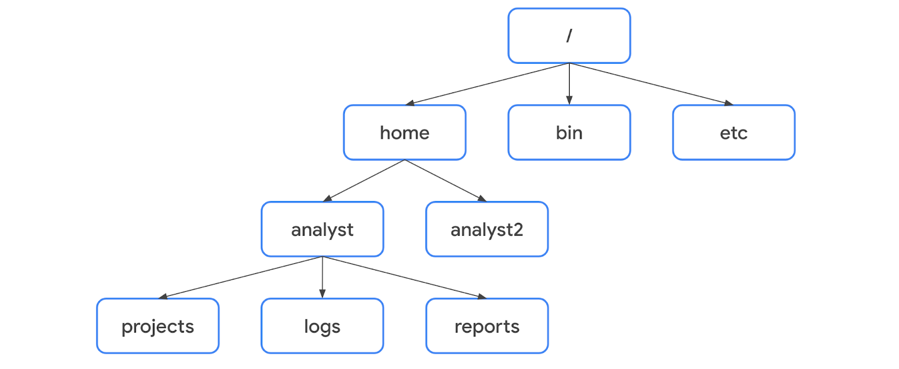

# Filesystem Hierarchy Standard (FHS)

## Overview
The **Filesystem Hierarchy Standard (FHS)** is the component of Linux that organizes data. It defines how directories, directory contents, and other storage are structured within the operating system. A file's location under the FHS is described using a **file path** — the location of a file or directory, with hierarchy levels separated by a forward slash (`/`).



## Key Concepts

### Root Directory
- The **root directory** is the highest-level directory in Linux, always represented by a forward slash (`/`).
- All subdirectories branch off the root directory and can continue branching to as many levels as necessary.

### Standard FHS Directories
Directly below the root directory are standard FHS directories:

| Directory | Purpose |
|-----------|---------|
| `/home` | Each user in the system gets their own home directory. |
| `/bin` | Stands for "binary"; contains binary files and other **executables** (files containing a series of commands a computer follows to run programs and perform functions). |
| `/etc` | Stores the system's configuration files. |
| `/tmp` | Stores temporary files. Commonly targeted by attackers since any user in the system can modify data here. |
| `/mnt` | Stands for "mount"; stores media such as USB drives and hard drives. |

> **Pro Tip:** Use `man hier` to learn more about the FHS and its standard directories.

### User-Specific Subdirectories
- Under `/home`, each user has their own subdirectory (e.g., `analyst`, `analyst2`) containing personal subdirectories such as `projects`, `logs`, or `reports`.
- The tilde (`~`) represents a user's home directory when referring to subdirectories beneath it. For example, `/home/analyst/logs` can be written as `~/logs`.

### Absolute vs. Relative File Paths
- **Absolute file path**: The full file path starting from the root (e.g., `/home/analyst/projects`).
- **Relative file path**: The file path starting from the user's current directory (e.g., `../projects`).
- A single dot (`.`) represents the current directory; two dots (`..`) represent the parent of the current directory.

## Commands / Tools

### Navigating the File System

**`pwd`** — Prints the working directory (the directory you are currently in), returning its absolute path.
```bash
pwd
# Example output: /home/analyst
```

> **Pro Tip:** Use `whoami` to display the username of the current user.
```bash
whoami
# Example output: analyst
```

**`ls`** — Displays the names of files and directories in the current working directory.
```bash
ls
```
To list the contents of a different directory, add its absolute or relative path as an argument:
```bash
ls /home/analyst/projects
ls projects
```

**`cd`** — Navigates between directories.
```bash
cd projects              # Navigate to a subdirectory
cd /home/analyst/logs    # Navigate using an absolute path
cd ..                    # Move up one directory level
```

### Reading File Content

**`cat`** — Displays the full content of a file.
```bash
cat updates.txt
```

**`head`** — Displays the beginning of a file (default: first 10 lines).
```bash
head updates.txt
head -n 5 updates.txt   # Display only the first 5 lines
```

**`tail`** — Displays the end of a file (default: last 10 lines). Useful for reading the most recent entries in a log file.
```bash
tail updates.txt
```

**`less`** — Displays file content one page at a time, allowing forward and backward navigation.
```bash
less updates.txt
```

**Keyboard controls within `less`:**

| Key | Action |
|-----|--------|
| `Space bar` | Move forward one page |
| `b` | Move back one page |
| `Down arrow` | Move forward one line |
| `Up arrow` | Move back one line |
| `q` | Quit and return to the previous terminal window |

## Key Takeaways
- The FHS organizes Linux's directory structure, starting from the root directory (`/`).
- Standard directories (`/home`, `/bin`, `/etc`, `/tmp`, `/mnt`) each serve a distinct purpose; `/tmp` is a common attacker target due to its open permissions.
- File paths can be absolute (from root) or relative (from current directory).
- Core navigation commands: `pwd`, `ls`, `cd`.
- Core file-reading commands: `cat`, `head`, `tail`, `less` — each suited to different use cases, from full content review to quick log inspection.