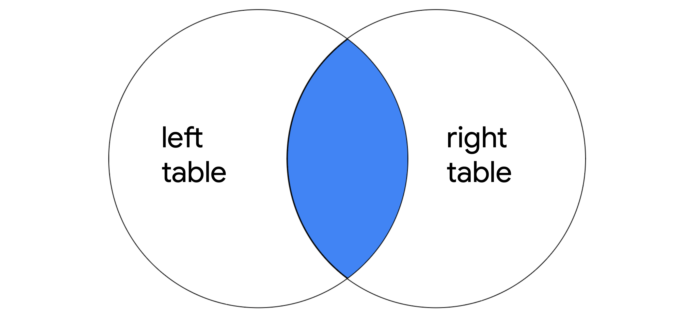
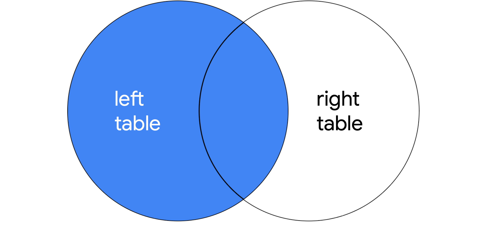
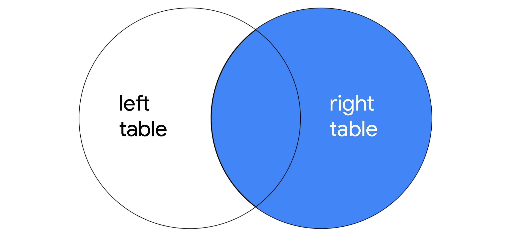
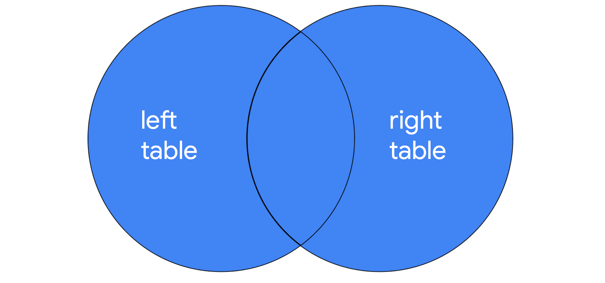

# SQL Joins

## Overview

SQL joins combine data from multiple tables that share a common column. Different types of joins return different sets of rows from the tables being joined.

## Key Concepts

### Inner Joins

`INNER JOIN` returns rows that match on a specified column existing in more than one table. It returns only matching rows, but includes all specified columns from all joined tables — if `SELECT *` is used, all columns from both tables are returned.



> **Note:** If a column exists in both tables, it is returned twice when `SELECT *` is used.

**Syntax:**

```sql
SELECT *
FROM employees
INNER JOIN machines ON employees.device_id = machines.device_id;
```

- The first (left) table is specified after `FROM`; the second (right) table is specified after `INNER JOIN`.
- The `ON` keyword and `=` operator indicate the column used to join the tables.
- Both table and column names must be specified (separated by a period `.`) when identifying the join column.

Specific columns can also be selected instead of `*`:

```sql
SELECT username, operating_system, employees.device_id
FROM employees
INNER JOIN machines ON employees.device_id = machines.device_id;
```

- Columns that exist in only one table (`username`, `operating_system`) can be written with just the column name.
- Columns that exist in both tables (`device_id`) must be qualified with the table name (`employees.device_id`).

### Outer Joins

Outer joins expand on what is returned from a join, returning all rows from either one table or both tables.

#### Left Joins

`LEFT JOIN` returns all records from the first (left) table, and only matching rows from the second (right) table.



```sql
SELECT *
FROM employees
LEFT JOIN machines ON employees.device_id = machines.device_id;
```

In this example, all records from `employees` (the left table) are returned. Only matching records from `machines` (the right table) are returned.

#### Right Joins

`RIGHT JOIN` returns all records from the second (right) table, and only matching rows from the first (left) table.



```sql
SELECT *
FROM employees
RIGHT JOIN machines ON employees.device_id = machines.device_id;
```

`RIGHT JOIN` uses the same syntax as `LEFT JOIN`, but returns all records from the right table (`machines`) and only matching records from the left table (`employees`).

> **Note:** `LEFT JOIN` and `RIGHT JOIN` can produce identical results if the table order is reversed. The following `RIGHT JOIN` returns the same result as the `LEFT JOIN` example above:
>
> ```sql
> SELECT *
> FROM machines
> RIGHT JOIN employees ON employees.device_id = machines.device_id;
> ```
>
> Switching the order of the tables before and after the join keyword swaps which table is treated as left and right.

#### Full Outer Joins

`FULL OUTER JOIN` returns all records from both tables — effectively a complete merge of the two tables.



```sql
SELECT *
FROM employees
FULL OUTER JOIN machines ON employees.device_id = machines.device_id;
```

Similar to `INNER JOIN`, the order of the tables does not affect the results of a `FULL OUTER JOIN`.

## Key Takeaways

- All joins return records that match on a specified column.
- `INNER JOIN` returns only matching records.
- `LEFT JOIN` returns all records from the left table plus matching records from the right table.
- `RIGHT JOIN` returns all records from the right table plus matching records from the left table.
- `FULL OUTER JOIN` returns all records from both tables.
- Table and column names must be qualified with a period (`.`) when a column name exists in both joined tables.