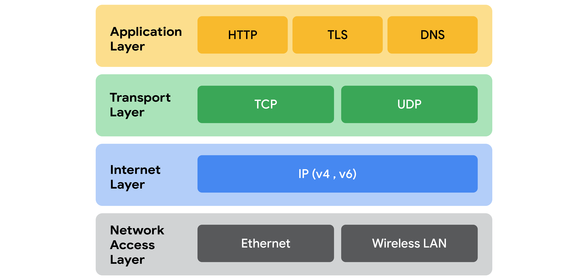

# TCP/IP Model and Network Protocols

## What is a Network Protocol?

A **network protocol** is a set of rules and standards that define how devices communicate and exchange data over a network.

Protocols handle tasks such as:

- Addressing
- Routing
- Data transmission
- Error detection
- Reliable communication

---

# TCP/IP Model

The **TCP/IP (Transmission Control Protocol/Internet Protocol) model** is the standard framework used to organize and transmit data across networks.

It has **4 layers**, each responsible for specific networking functions.

| Layer | Purpose |
|--------|---------|
| **Application** | Provides network services to applications |
| **Transport** | Reliable communication and data delivery |
| **Internet** | Addressing and routing packets |
| **Network Access** | Physical transmission of data |

---

# 1. Network Access Layer

## Purpose

Handles the creation and transmission of data packets across the physical network.

### Responsibilities

- Physical communication
- Data packet creation
- Local network communication
- Hardware interaction

### Devices

- Hubs
- Switches
- Modems
- Network cables
- NICs

---

## Address Resolution Protocol (ARP)

### Definition

**ARP (Address Resolution Protocol)** maps an **IP address** to a **MAC address** on a local network.

### Purpose

- Enables local device communication
- Finds the correct MAC address for a given IP address

---

# 2. Internet Layer

## Purpose

Routes packets between different networks using IP addresses.

### Main Responsibilities

- Logical addressing
- Packet routing
- Delivery between networks
- Selecting routing paths

---

## Internet Protocol (IP)

### Function

- Assigns source and destination IP addresses
- Routes packets to the correct network
- Works with TCP or UDP for delivery

---

## Internet Control Message Protocol (ICMP)

### Definition

**ICMP** reports network errors and provides diagnostic information.

### Uses

- Detect network connectivity problems
- Report dropped packets
- Report routing issues
- Support troubleshooting tools (e.g., **ping**)

---

# 3. Transport Layer

## Purpose

Provides end-to-end communication between devices.

### Responsibilities

- Data delivery
- Error control
- Flow control
- Connection management

---

## Transmission Control Protocol (TCP)

### Characteristics

- Connection-oriented
- Reliable delivery
- Error checking
- Packet retransmission
- Maintains packet order

### Best For

- Web browsing
- Email
- File transfers

---

## User Datagram Protocol (UDP)

### Characteristics

- Connectionless
- Faster than TCP
- No guaranteed delivery
- Minimal error checking

### Best For

- Video streaming
- Voice calls (VoIP)
- Online gaming
- Live broadcasts

---

## TCP vs UDP

| TCP | UDP |
|-----|-----|
| Connection-oriented | Connectionless |
| Reliable | Faster |
| Error checking | Minimal error checking |
| Retransmits lost packets | No retransmission |
| Used for email, web, FTP | Used for streaming and gaming |

---

# 4. Application Layer

## Purpose

Provides network services directly to applications used by end users.

### Responsibilities

- Sends network requests
- Receives responses
- Defines application-level communication

---

## Common Application Layer Protocols

### HTTP (Hypertext Transfer Protocol)

Transfers web pages over the Internet.

---

### SMTP (Simple Mail Transfer Protocol)

Sends email between mail servers.

---

### SSH (Secure Shell)

Provides secure remote access to systems.

---

### FTP (File Transfer Protocol)

Transfers files between computers.

---

### DNS (Domain Name System)

Converts domain names (e.g., `google.com`) into IP addresses.

---

# TCP/IP Layer Protocol Summary

| TCP/IP Layer | Common Protocols |
|--------------|------------------|
| Application | HTTP, SMTP, SSH, FTP, DNS |
| Transport | TCP, UDP |
| Internet | IP, ICMP |
| Network Access | ARP |

---

# TCP/IP vs OSI Model

| TCP/IP Model | OSI Model |
|--------------|-----------|
| 4 Layers | 7 Layers |
| Simpler | More detailed |
| Widely used on the Internet | Primarily a reference model |
| Combines several OSI layers | Separates functions into seven layers |

### Layer Mapping

| TCP/IP | OSI Equivalent |
|---------|----------------|
| Application | Application + Presentation + Session |
| Transport | Transport |
| Internet | Network |
| Network Access | Data Link + Physical |

---

# Importance for Security Analysts

Understanding network protocols helps analysts:

- Detect malicious traffic
- Troubleshoot network issues
- Analyze packet captures
- Monitor protocol behavior
- Identify attacks at specific TCP/IP layers

---

# Key Takeaways

- A **network protocol** is a set of rules that governs communication between devices on a network.
- The **TCP/IP model** has **4 layers**: **Network Access**, **Internet**, **Transport**, and **Application**.
- **ARP** operates at the **Network Access Layer** and maps IP addresses to MAC addresses.
- The **Internet Layer** uses:
  - **IP** for addressing and routing.
  - **ICMP** for error reporting and network diagnostics.
- The **Transport Layer** includes:
  - **TCP** for reliable, connection-oriented communication.
  - **UDP** for fast, connectionless communication used by real-time applications.
- The **Application Layer** includes protocols such as **HTTP, SMTP, SSH, FTP, and DNS**.
- The **TCP/IP model** is the practical networking standard, while the **OSI model** is a more detailed conceptual model with **7 layers**.