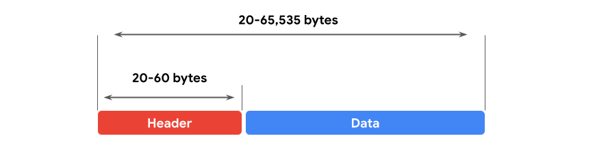
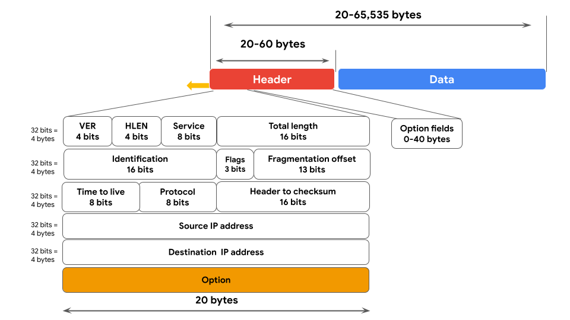
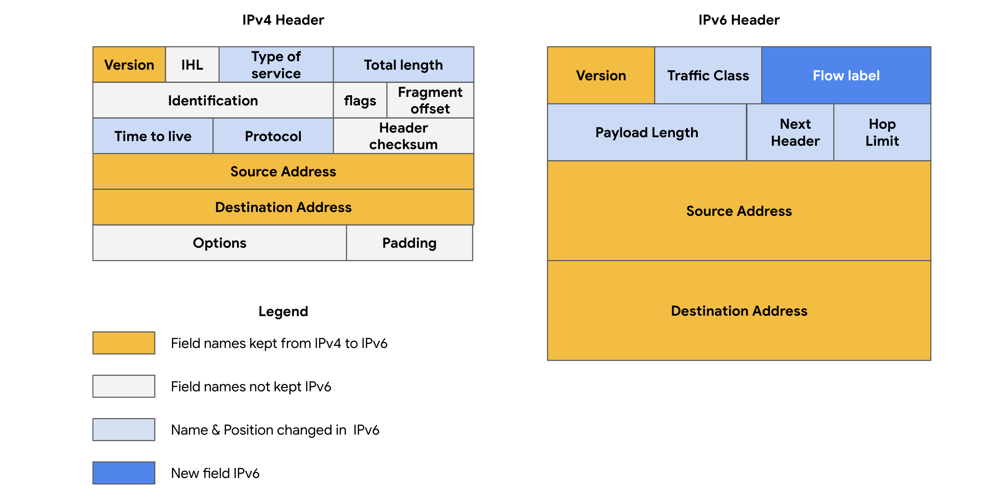

# IP Packets and IPv4 Header

## Network Layer Operations

The **Network Layer** is responsible for **addressing, routing, and delivering data packets** from the source device to the destination device.

Routers use the **destination IP address** in the packet header to forward packets across networks until they reach their destination.

---

# IP Packet

An **IP packet** is the basic unit of data transmitted at the Network Layer.

- For **TCP**, it is commonly called an **IP packet**.
- For **UDP**, it is often referred to as a **datagram**.

An IP packet consists of:

1. **Header** – Routing and control information.
2. **Data (Payload)** – The actual message being transmitted.

---

# IPv4 Packet Structure

## 1. Header

The **IPv4 header** contains routing and control information used by routers.

### Characteristics

- Size: **20–60 bytes**
- Includes addressing, routing, protocol, and error-checking information.

---

## 2. Data (Payload)

Contains the actual transmitted information, such as:

- Web page content
- Email messages
- File data

### Maximum IPv4 Packet Size

**65,535 bytes**

---

# IPv4 Header Fields

| Field | Purpose |
|--------|---------|
| **Version (VER)** | Indicates the IP version (IPv4). |
| **Header Length (IHL/HLEN)** | Specifies where the header ends and data begins. |
| **Type of Service (ToS)** | Helps routers prioritize traffic (Quality of Service). |
| **Total Length** | Total size of the packet (header + data). |
| **Identification** | Identifies fragmented packets for reassembly. |
| **Flags** | Indicates fragmentation information. |
| **Fragment Offset** | Shows the position of each fragment in the original packet. |
| **Time to Live (TTL)** | Limits how many routers a packet can pass through before being discarded. |
| **Protocol** | Specifies the transport protocol (e.g., TCP or UDP). |
| **Header Checksum** | Detects errors in the packet header. |
| **Source IP Address** | IP address of the sender. |
| **Destination IP Address** | IP address of the receiver. |
| **Options** | Optional security and routing information. |

---

# Important Header Fields for Security

## Time to Live (TTL)

- Prevents packets from circulating forever.
- Decreases by **1** at every router.
- When TTL reaches **0**, the packet is discarded and an **ICMP Time Exceeded** message is sent.

---

## Protocol Field

Identifies the transport protocol used.

Examples:

- **TCP**
- **UDP**
- **ICMP**

---

## Header Checksum

Used to verify the integrity of the IPv4 header.

- Detects corruption during transmission.
- Corrupted packets are discarded.

---

# Packet Fragmentation

Large IPv4 packets may be divided into smaller fragments if they exceed the network's maximum transmission size.

The following fields support fragmentation:

- **Identification**
- **Flags**
- **Fragment Offset**

These fields allow the destination device to correctly reassemble the original packet.

---

# IPv4 vs IPv6

| Feature | IPv4 | IPv6 |
|---------|------|-------|
| Address Size | 32-bit | 128-bit |
| Address Format | Decimal | Hexadecimal |
| Example | 198.51.100.0 | 2002:0db8::ff21:0023:1234 |
| Maximum Addresses | ~4.3 Billion | ~340 Undecillion (3.4 × 10³⁸) |
| Header | More complex | Simpler and more efficient |

---

# Why IPv6 Was Introduced

IPv6 was developed to solve **IPv4 address exhaustion**, where the limited number of IPv4 addresses could no longer support the growing number of Internet-connected devices.

Benefits include:

- Vastly larger address space
- Simpler header
- More efficient routing
- Reduced address conflicts
- Better scalability

---

# IPv6 Header Difference

Unlike IPv4, IPv6:

- Removes fields such as **IHL, Identification, and Flags**.
- Introduces the **Flow Label** field, which identifies packets requiring special handling by routers.

---

# Security Importance of IP Packets

By examining packet headers, security analysts can determine:

- Source IP address
- Destination IP address
- Protocol in use
- Packet size
- Routing information
- Signs of malformed or suspicious traffic

This information is essential for network monitoring, incident investigation, and threat detection.

---

# Key Takeaways

- The **Network Layer** routes data packets between networks using **IP addresses**.
- An **IPv4 packet** consists of a **header** (20–60 bytes) and a **data (payload)** section, with a maximum packet size of **65,535 bytes**.
- Important IPv4 header fields include **Version, Header Length, Type of Service, Total Length, Identification, Flags, Fragment Offset, Time to Live (TTL), Protocol, Header Checksum, Source IP Address, Destination IP Address, and Options**.
- **TTL** prevents packets from looping indefinitely by decreasing at each router until the packet is discarded.
- **IPv6** was introduced to overcome **IPv4 address exhaustion**, providing a **128-bit** address space, a simplified header, and more efficient routing.
- Security analysts inspect IP packet headers to identify the **source, destination, protocol, routing details, and potential security issues** associated with network traffic.