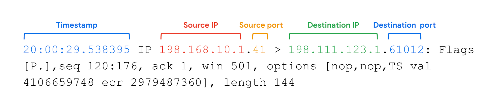

# Network Protocol Analyzers (tcpdump)

## What is a Network Protocol Analyzer?

A **Network Protocol Analyzer (Packet Sniffer/Packet Analyzer)** is a tool used to capture, inspect, and analyze network traffic (data packets).

### Purpose

- Monitor network activity
- Troubleshoot network issues
- Detect suspicious or malicious traffic
- Investigate security incidents
- Analyze communication between devices

---

# Common Network Protocol Analyzers

- **tcpdump**
- **Wireshark**
- **SolarWinds NetFlow Traffic Analyzer**
- **ManageEngine OpManager**
- **Azure Network Watcher**

> **Note:** In this course, the primary focus is on **tcpdump**.

---

# What is tcpdump?

**tcpdump** is a **command-line network protocol analyzer** used to capture and inspect network packets.

### Features

- Command-line based
- Lightweight (low CPU and memory usage)
- Open source
- Uses the **libpcap** library
- Pre-installed on many Linux distributions
- Also available on macOS and other Unix-based systems

---

# Information Displayed by tcpdump

Each captured packet typically includes:

| Field | Description |
|--------|-------------|
| **Timestamp** | Time the packet was captured |
| **Source IP Address** | IP address of the sender |
| **Source Port** | Port used by the sender |
| **Destination IP Address** | IP address of the receiver |
| **Destination Port** | Port used by the receiver |

> **Note:** By default, tcpdump attempts to resolve IP addresses into hostnames and port numbers into their associated service names (e.g., port 80 → HTTP).

---

# Example Packet Information

This indicates:

- **Timestamp**: The output begins with the timestamp, formatted as hours, minutes, seconds, and fractions of a second.  
- **Source IP**: The packet’s origin is provided by its source IP address.
- **Source port**: This port number is where the packet originated.
- **Destination IP**: The destination IP address is where the packet is being transmitted to.
- **Destination port**: This port number is where the packet is being transmitted to.

---

# Common Uses of tcpdump

## 1. Monitor Network Traffic

Capture packets traveling across a network to observe communications.

---

## 2. Troubleshoot Network Problems

Identify:

- Connectivity issues
- Slow network performance
- Packet loss
- Communication failures

---

## 3. Establish a Baseline

Record normal network behavior to help identify abnormal activity later.

---

## 4. Detect Malicious Activity

Identify attacks such as:

- DoS/DDoS attacks
- Port scanning
- Suspicious connections
- Unauthorized devices

---

## 5. Generate Alerts

Support customized monitoring and notifications when unusual network activity occurs.

---

## 6. Locate Unauthorized Devices

Identify:

- Rogue wireless access points
- Unauthorized instant messaging traffic
- Unknown devices on the network

---

# Security Risks

Although tcpdump is a defensive tool, attackers can also misuse packet analyzers.

They may capture:

- Usernames
- Passwords
- Session cookies
- Credit card information
- Sensitive communications

This is why encrypted protocols like **HTTPS**, **SSH**, and **VPNs** are essential.

---

# Importance for Security Analysts

Security analysts use tcpdump to:

- Investigate suspicious traffic
- Analyze packet flows
- Identify attack patterns
- Detect abnormal network behavior
- Troubleshoot incidents
- Support forensic investigations

---

# Key Takeaways

- A **Network Protocol Analyzer** (also called a **packet sniffer** or **packet analyzer**) captures and analyzes network traffic.
- **tcpdump** is a lightweight, open-source, command-line packet analyzer commonly used on Linux, macOS, and other Unix-based systems.
- tcpdump displays essential packet details, including the **timestamp**, **source IP**, **source port**, **destination IP**, and **destination port**.
- Security professionals use tcpdump to **monitor network traffic**, **troubleshoot performance issues**, **detect malicious activity**, establish **traffic baselines**, and investigate security incidents.
- Packet analyzers are powerful security tools, but attackers can also use them to capture sensitive information such as usernames and passwords if network traffic is not properly encrypted.