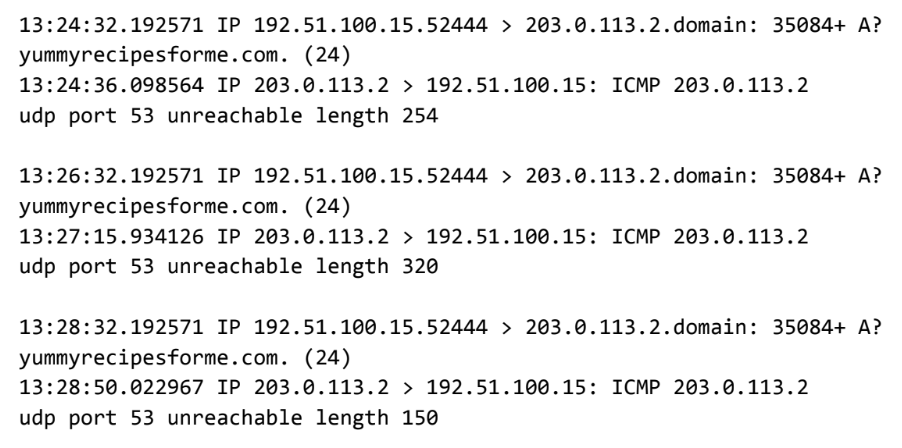

# DNS and ICMP Traffic Analysis

## Activity Overview

In this activity, you will analyze **DNS and ICMP traffic** using data captured by a network protocol analyzer called **tcpdump**.

The goal is to identify which **network protocol and service were affected** during a cybersecurity incident.

Understanding network traffic allows security analysts to identify suspicious or failed communications and determine the possible cause of a network issue.

---

## Scenario

You are a cybersecurity analyst working for a company that provides IT services to clients.

Several customers report that they cannot access the website:

`www.yummyrecipesforme.com`

Instead of loading the website, they receive the error:

`destination port unreachable`

You attempt to access the website yourself and receive the same error.

To investigate the issue, you use **tcpdump** to capture the network traffic generated when attempting to access the website.



---

## How the Website Request Works

Before a browser can access a website, it needs to determine the website's IP address.

The process works roughly like this:

1. The browser sends a **DNS request**.
2. The DNS request asks a DNS server for the IP address of `www.yummyrecipesforme.com`.
3. DNS normally uses **UDP port 53**.
4. The DNS server should return the requested IP address.
5. The browser then uses that IP address to send an **HTTPS request** to the web server.

In this incident, something goes wrong during the DNS step.

---

## What tcpdump Shows

The tcpdump log shows that:

* The computer sends a DNS request using **UDP**.
* The request is sent to the DNS server at `203.0.113.2`.
* The DNS service uses **port 53**.
* Instead of receiving a DNS response, the computer receives an **ICMP error**.
* The ICMP error states:

`udp port 53 unreachable`

This indicates that the DNS request could not reach a service listening on UDP port 53.

---

## Understanding the Packet Information

A tcpdump entry contains several important pieces of information.

### Timestamp

Example:

`13:24:32.192571`

This indicates that the packet was captured at:

**1:24 PM, 32.192571 seconds**

Timestamps help analysts determine when network events occurred and understand the sequence of events.

---

## Source and Destination IP Addresses

Example:

`192.51.100.15 > 203.0.113.2.domain`

The address on the left is the **source IP address**:

`192.51.100.15`

This represents the computer sending the DNS request.

The address on the right is the **destination IP address**:

`203.0.113.2`

This represents the DNS server receiving the request.

For the ICMP response, the direction is reversed:

`203.0.113.2 > 192.51.100.15`

This means the DNS server is sending the error message back to the computer.

---

## DNS Request Details

The DNS request contains information such as:

`35084`

This is the query identification number.

The request also contains:

`A?`

This indicates that the computer is requesting an **A record**.

An **A record** maps a domain name to an IPv4 address.

For example:

```text
www.example.com → 192.0.2.10
```

The browser needs this IP address before it can connect to the website's server.

---

## ICMP Error

The third line of the tcpdump output identifies the response protocol as:

`ICMP`

The error message is:

`udp port 53 unreachable`

This is the most important piece of information in the investigation.

### What does it mean?

* **UDP** was used to send the DNS request.
* **Port 53** is the standard port used by DNS.
* **Unreachable** means the request could not be delivered to a service listening on that port.
* **ICMP** was used to report the delivery error back to the requesting computer.

Therefore, the problem is related to **DNS communication over UDP port 53**.

---

## Repeated ICMP Errors

The tcpdump log shows that the ICMP error occurred multiple times.

The computer sent additional DNS requests, but each attempt resulted in the same:

`udp port 53 unreachable`

Repeated failures make it less likely that the problem was simply a temporary communication issue.

---

## Identifying the Affected Protocol

The main protocol affected by the incident is:

**DNS (Domain Name System)**

DNS is responsible for translating:

```text
www.yummyrecipesforme.com
```

into an IP address.

The DNS request uses:

```text
UDP port 53
```

The failure is reported using:

```text
ICMP
```

So, although ICMP appears in the error response, the service that is actually failing is the **DNS service**.

---

## Protocols Involved

| Protocol  | Purpose                                   | Role in the Incident                               |
| --------- | ----------------------------------------- | -------------------------------------------------- |
| **DNS**   | Translates domain names into IP addresses | The affected service                               |
| **UDP**   | Transports the DNS request                | Used to send the DNS query                         |
| **ICMP**  | Reports network errors                    | Returned the "port unreachable" error              |
| **HTTPS** | Securely communicates with the website    | Could not be reached because DNS resolution failed |

---

## TCP/IP Model

The incident involves multiple layers of the TCP/IP model.

### Application Layer

**DNS**

The browser uses DNS to request the IP address associated with the website.

### Transport Layer

**UDP**

The DNS request is transported using UDP port 53.

### Internet Layer

**IP and ICMP**

IP handles addressing and delivery, while ICMP reports that the destination UDP port is unreachable.

---

## Security Analyst's Investigation

As a security analyst, the goal is not simply to notice that the website is unavailable.

You need to determine **why** it is unavailable.

The investigation can be summarized as:

```text
User attempts to access website
            ↓
Browser needs website IP address
            ↓
DNS request is sent
            ↓
DNS request uses UDP port 53
            ↓
DNS service does not respond
            ↓
ICMP reports "UDP port 53 unreachable"
            ↓
DNS resolution fails
            ↓
Website cannot be accessed
```

This packet-level information gives the analyst evidence about where the communication is failing.

---

## Follow-Up Report

Based on the tcpdump analysis, the affected service is the **DNS service**.

The computer repeatedly sends DNS queries to the DNS server using **UDP port 53**. Instead of receiving DNS responses, the computer receives **ICMP "UDP port 53 unreachable"** messages from the DNS server.

Because DNS cannot resolve `www.yummyrecipesforme.com` to its IP address, the browser cannot proceed to the HTTPS connection with the web server.

The incident therefore appears to be caused by an issue with the DNS service or its availability on UDP port 53.

The security engineering team should investigate why the DNS service is unavailable and determine whether the issue is caused by a configuration problem, service failure, firewall rule, network issue, or potential security incident.

---

## Key Takeaways

* **DNS** translates domain names into IP addresses.
* DNS commonly uses **UDP port 53**.
* **ICMP** is used to report network errors.
* `udp port 53 unreachable` indicates that the DNS request could not reach a service listening on UDP port 53.
* tcpdump provides useful information such as timestamps, source IPs, destination IPs, protocols, and ports.
* Packet analysis helps security analysts identify where network communication is failing.
* In this scenario, the **DNS service is the affected service**, while **UDP and ICMP** are involved in the communication and error reporting.
* The failure of DNS resolution prevents the browser from reaching the requested website.
