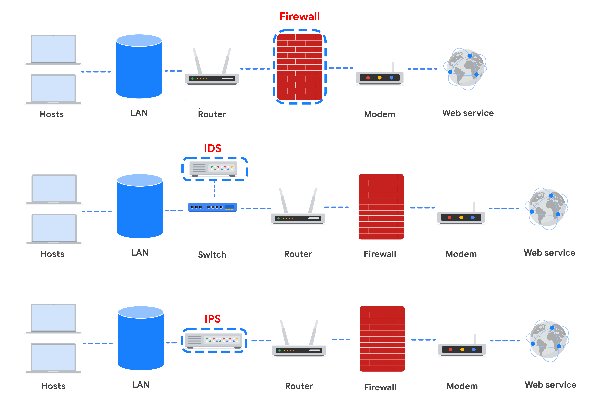
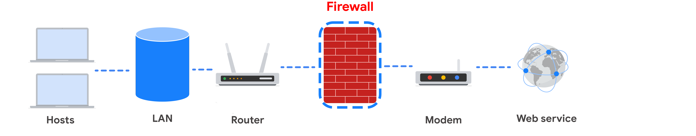
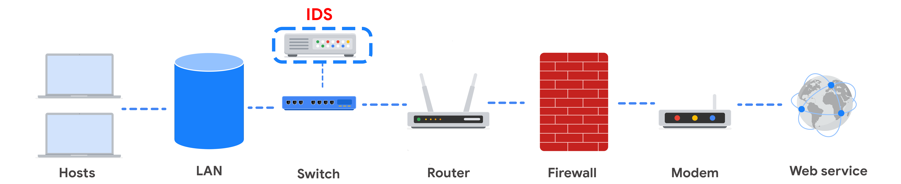
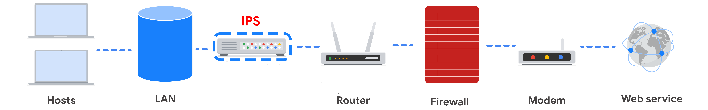
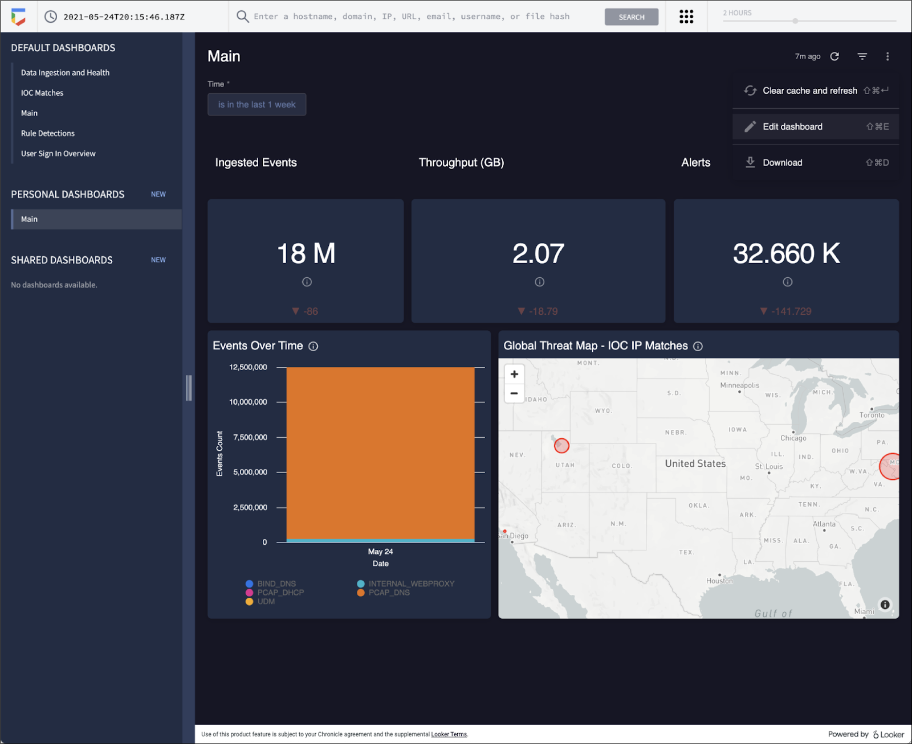

# Network Security Application

## Overview

Network hardening involves layering multiple devices, tools, and strategies to progressively strengthen a network's security. This layered approach is known as **defense in depth**. Security professionals combine firewalls, intrusion detection systems, intrusion prevention systems, and security information and event management tools to reach their desired level of security, with each tool representing an additional layer of protection and each occupying a specific position within the network's architecture.

## Firewall

Firewalls allow or block traffic based on a set of rules. Incoming data packets are inspected at the header level and allowed or denied based on port number. **Next-generation firewalls (NGFWs)** can additionally inspect packet payloads, unlike stateless and stateful firewalls.

- Every system should have its own firewall in addition to the network firewall.
- **Limitation:** A firewall can only filter packets based on information available in the packet header.

## Intrusion Detection System (IDS)

**Intrusion Detection System (IDS):** An application that monitors system activity and alerts administrators to possible intrusions.

- Detects known attacks by sniffing data packets and analyzing them against attack signatures.
- Some IDS systems also detect anomalies that may indicate malicious activity.
- When an anomaly is found, the IDS alerts the network administrator for further investigation.
- **Limitations:**
  - Only detects known attacks or obvious anomalies; sophisticated or novel attacks may go unnoticed.
  - Does not stop incoming traffic — administrators must respond manually.
- **Placement:** Positioned behind the firewall and before the LAN, so it only analyzes traffic that has already passed firewall filtering. This reduces **false positives** (noise in IDS alerts).

## Intrusion Prevention System (IPS)

**Intrusion Prevention System (IPS):** An application that monitors system activity for intrusions and takes action to stop them.

- Searches for signatures of known attacks and data anomalies.
- Unlike an IDS, it actively blocks the sender or drops suspicious packets rather than only reporting.
- **Placement:** Sits behind the firewall, like an IDS, disrupting risky data streams before they reach sensitive parts of the network.
- **Limitations:**
  - Operates inline — if the IPS fails, the connection between the private network and the internet breaks.
  - May generate false positives, causing legitimate traffic to be dropped.

## Full Packet Capture Devices

Full packet capture devices record and analyze all data transmitted over a network. They are useful for:

- General network analysis by administrators and security professionals.
- Investigating alerts generated by an IDS.

## Security Information and Event Management (SIEM)

**Security Information and Event Management (SIEM):** An application that collects and analyzes log data to monitor critical activities across an organization.

- Works in real time, reporting suspicious activity through a centralized dashboard — a **single pane of glass**.
- Aggregates log data from IDSs, IPSs, firewalls, VPNs, proxies, and DNS logs.
- Does not replace analyst expertise or network/system hardening — it works alongside these practices.
- Security analysts typically monitor SIEM dashboards from a **Security Operations Center (SOC)**, using their expertise to decide when events should be escalated to oversight.

### Common SIEM Tools

- **Chronicle** – Google Cloud's cloud-native SIEM tool, designed to retain, analyze, and search data.
- **Splunk** – Available as Splunk Enterprise or Splunk Cloud, both offering detailed dashboards for reviewing and analyzing organizational data.

> **Note:** Other SIEM tools exist beyond Chronicle and Splunk; security professionals should evaluate options to find the best fit for their organization.

## Comparison of Network Security Tools

| Device / Tool | Advantages | Disadvantages |
|---|---|---|
| **Firewall** | Allows or blocks traffic based on a set of rules. | Can only filter packets based on header information. |
| **IDS** | Detects and alerts admins about possible intrusions, attacks, and malicious traffic. | Only scans for known attacks or obvious anomalies; doesn't stop traffic. |
| **IPS** | Monitors and actively stops intrusions and anomalies. | Inline appliance — failure breaks connectivity; may block legitimate traffic (false positives). |
| **SIEM** | Collects and analyzes log data from multiple sources; centralizes monitoring. | Only reports issues; does not take action to stop or prevent them. |

## Key Takeaways

- **Defense in depth** combines multiple tools to progressively harden a network.
- Firewalls filter traffic by header/port (and payload, for NGFWs); IDS detects and alerts; IPS detects and actively blocks; SIEM aggregates and centralizes monitoring data.
- IDS and IPS are placed behind the firewall to reduce false positives and stop threats before they reach the LAN.
- SIEM tools support but do not replace analyst expertise and hardening practices.
- Choosing which tools to deploy involves balancing cost, staffing needs, and organizational risk.